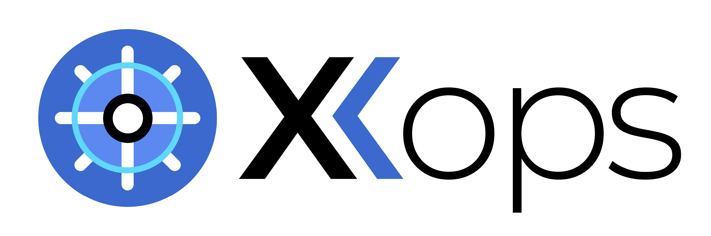
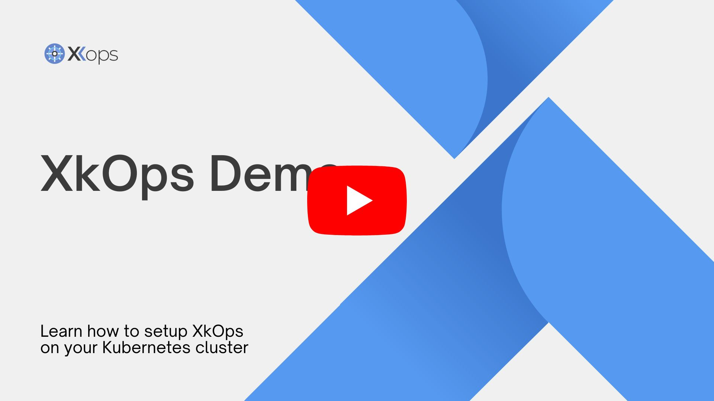

# XkOps



[](https://github.com/X-CBG/xk8s/actions/workflows/linter.yml)
[](https://github.com/XgridInc/xkops/actions/workflows/build_publish_scan.yml)
[](https://github.com/XgridInc/xkops/actions/workflows/shellcheck.yml)

## 💻 Overview

Xkops is an integrated solution that combines widely-adopted open-source utilities to simplify Kubernetes management, emphasizing the enhancement of observability, reliability, security, and cost control in cluster operations which help users optimize the deployment and management of Kubernetes clusters. The platform provides a comprehensive evaluation of costs, observability, and security.
XkOps provides an effortless way for users to manage their cluster and extract meaningful insights related to observerability and cost. The platform includes the installers of top-tier open-source tools, namely Kubecost, Robusta, and Pixie, which are bundled together into a single Docker image. This Docker image is then deployed as a Pod, simplifying the installation process of these tools.
This all-in-one solution consolidates the insights obtained from these tools, making it easier for users to make informed decisions and have centralized monitoring of their Kubernetes cluster.

Check the below video for a quick demo of XkOps.

[](https://youtu.be/l-psN4IDDBA)

## 🏗️ XkOps Architecture Diagram


## 💡 Why XkOps?

XkOps is a unified platform that provides true observability across Kubernetes clusters while being cost-optimized, fault-tolerant, and secure. With an abundance of tools available, implementing and managing multiple data platforms can become overwhelming and lead to additional costs.

XkOps simplifies this by offering a single platform that provides a single source of truth, making it easier for users to gain insights and manage their cluster. Achieving optimal cost efficiency, state-of-the-art security, and dependable application performance through observability is a necessity for Kubernetes clusters.
XkOps addresses this by encompassing the three core concepts of cost optimization, reliability, and security in a single platform.

## 🛠️ Use cases

XkOps can be used for several use cases, including:

**Observability:** XkOps provides detailed visibility into the behavior and performance of applications running in the Kubernetes cluster, including metrics, logs, and traces. This allows teams to identify and diagnose performance issues and respond quickly to ensure the availability and stability of the applications.

**Cost Management:** XkOps provides cost and usage insights, including granular breakdowns of resource usage, and the ability to identify and address over-provisioning and under-utilization in a Kubernetes cluster. The platform also provides cost forecasting and optimization recommendations, allowing teams to plan for future growth and manage expenses more effectively.

**Security:** XkOps provides detailed visibility into the behavior and performance of applications deployed in a Kubernetes cluster, helping teams identify and address security issues, such as misconfigurations or vulnerabilities. The platform also provides alerts and notifications of suspicious activity, enabling teams to respond quickly to potential security threats.

**Alerting:** XkOps provides alerting capabilities to notify teams of issues in any Kubernetes cluster in near real-time, enabling them to quickly address problems before they become critical.

**Reporting:** XkOps allows users to generate reports to share with stakeholders about the cost, performance, and security of the Kubernetes cluster over time.

## ➕ Dependencies

Please note the following requirements for using the XkOps:

- To install the necessary dependencies, an internet connection is required.
- You will need an EKS cluster and an AWS IAM user with a minimum set of permissions listed in this [spreadsheet](https://docs.google.com/spreadsheets/d/1cuC-72oRJ7DB4HkvELpml5RLcA2clzCA7xBVd1z6fVw/edit?usp=sharing).
- The pod resources must meet the minimum requirements of 200MiB memory and 500m CPU.
- Please ensure that you use a separate XkOps namespace.

## 📒 Getting Started

To install XkOps, please follow these steps

### 🔐 Secret Manager Setup

First, set up AWS secrets manager on your AWS account:

- Refer to this [guide](https://docs.google.com/document/d/17fhQ0zJZtJGcWtnVD8NehUbFC-x9TrMP11XjyEFi370/edit?usp=sharing) for instructions on how to set up AWS secret manager OR
- Use [this script](https://github.com/XgridInc/xkops/blob/master/secret-manager/secret-manager.sh) to automate the setup process.

### 📥 Install XkOps

1. Clone the repository and navigate to the cloned repo:

    ```commandline
    git clone https://github.com/XgridInc/xkops.git && cd xkops
    ```

2. Update values.yaml file and input your specific value for each key.
3. Install XkOps using Helm:

    ```commandline
    helm install xkops ./helm -f values.yml
    ```

4. After successful installation, obtain the link of the XkOps frontend service to access the dashboard:

    ```commandline
    kubectl get svc -n xkops
    ```

5. Create an unclaimed volume in your cluster and delete it using the delete button on the dashboard. You can verify the volume deletion action both from the dashboard and the cluster.

## 🚧 Road Map

To report a new feature request or to report any issues or bugs encountered while using XkOps, please feel free to [create a new issue](https://github.com/XgridInc/xkops/issues "create a new issue") on the project's GitHub repository or contact the development team via [Slack Channel](https://join.slack.com/t/xkopscommunity/shared_invite/zt-1u8xzjvvq-B52TJ2XE861v3KDvpA9UVg). The following features are currently either in progress or planned:

- [X] Checking for observability tools in your Kubernetes cluster.
- [X] Installing tools to mitigate risk.
- [X] Using Robusta to monitor and troubleshoot clusters.
- [X] Employing Kubecost for cost optimization.
- [X] Utilizing Pixie to monitor system performance.
- [x] Deployment using Helm charts.
- [ ] Implementation of a user interface.
- [ ] Determining risk factors based on metrics from your Kubernetes cluster.
- [ ] Extracting logs from pod using a logging solution

## 🤝 How to contribute

We invite you to contribute to XkOps, which is a community driven project.  If you plan on contributing code, kindly go through our [contribution guide](https://github.com/XgridInc/xkops/blob/master/CONTRIBUTING.md).

- To report a bug or request a feature, you can submit a [GitHub issue](https://github.com/XgridInc/xkops/issues "create a new issue").
- For real-time discussions and immediate assistance, please join our [Slack channel](https://join.slack.com/t/xkopscommunity/shared_invite/zt-1u8xzjvvq-B52TJ2XE861v3KDvpA9UVg).

## 🧾 License

XkOps is distributed under the MIT License. See [LICENSE.md](https://github.com/X-CBG/xk8s/blob/master/LICENSE "LICENSE.md") for more information
