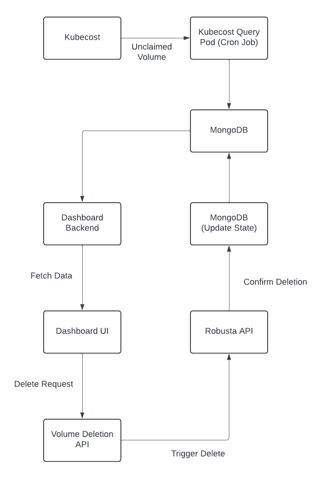

# Xworkflow 1: Get and Delete Unclaimed Volumes

This workflow automates the process of identifying and deleting unclaimed Persistent Volumes (PVs) in your Kubernetes cluster. It leverages Kubecost and Robusta to achieve this functionality.

## Data Flow/Architecture Diagram:

## How it Works

- ### Kubecost identifies unclaimed PVs 
    Kubecost, deployed in the kubecost namespace, scans your cluster and identifies PVs with the Available status, signifying they are unclaimed.
- ### Data Persistence with MongoDB 
    The information about these unclaimed PVs is stored in a MongoDB StatefulSet deployed in this workflow.
- ### Flask Backend for Interaction
     This workflow utilizes a custom Flask backend deployed in the cluster. The backend interacts with the MongoDB to manage unclaimed PVs.The backend has two endpoints:

    - **GET /unclaimed_pvs:** This endpoint retrieves a list of all unclaimed PVs from the MongoDB.
    - **POST /delete_pv:** This endpoint accepts a JSON payload containing the name of the PV to be deleted. The workflow deletes the PV from the cluster and updates the MongoDB record with a "deleted" status.

## Requirements
- Running Kubernetes cluster
- Kubecost installed in the kubecost namespace
- Robusta installed in the robusta namespace

## Installation
### Apply provided Kubernetes manifests:
- MongoDB StatefulSet, Headless Service & Storage Class
- Kubecost CronJob
- Backend Deployment and Service
- Example unclaimed PV for testing the workflow (Optional)

### Initialize MongoDB Replicaset
After applying the manifests, you have to create a replica set within the MongoDB StatefulSet to ensure data synchronization across pods.

- Execute the following command to connect to any MongoDB StatefulSet pod:

    ```
    kubectl exec -it <mongodb-statefulset-pod-name> -- mongosh
    ```

- Inside the pod, initialize the replica set with the following command:
    
    ```
    rs.initiate({
    _id: "xworkflowReplSet",
    members: [
        { _id: 0, host: "xworkflow-mongodb-0.xworkflow-mongodb.default.svc.cluster.local:27017" },
        { _id: 1, host: "xworkflow-mongodb-1.xworkflow-mongodb.default.svc.cluster.local:27017" },
        { _id: 2, host: "xworkflow-mongodb-2.xworkflow-mongodb.default.svc.cluster.local:27017" }
    ]
    });
    ```
### Load Robusta action
- Install Robusta CLI
- Use the command 
    ```
    robusta playbooks push "<path-to-rb-action-folder>" --namespace="<namespace-where-robusta-is-deployed>"
    ```
## Usage (Testing with Postman)
- Obtain the IP address of your node and the port of the backend service.
- Use a tool like Postman to test the workflow endpoints:
- **GET /unclaimed_pvs:** This retrieves a list of unclaimed PVs from the MongoDB.
    - Example Request:
        ```
        GET http://<node-ip>:<backend-service-port>/unclaimed_pvs
        ```
- **POST /delete_pv:** This endpoint deletes a specific PV. Provide the PV name in the JSON payload.
    - Example Request:
    ```
    POST http://<node-ip>:<backend-service-port>/delete_pv

    Body: {"pv_name": "<name-of-pv-to-delete>"}
    ```
## References

- [Robusta](https://home.robusta.dev/)
- [Kubecost](https://www.kubecost.com/)
- [Robusta: Load External Action](https://docs.robusta.dev/master/playbook-reference/defining-playbooks/external-playbook-repositories.html)


