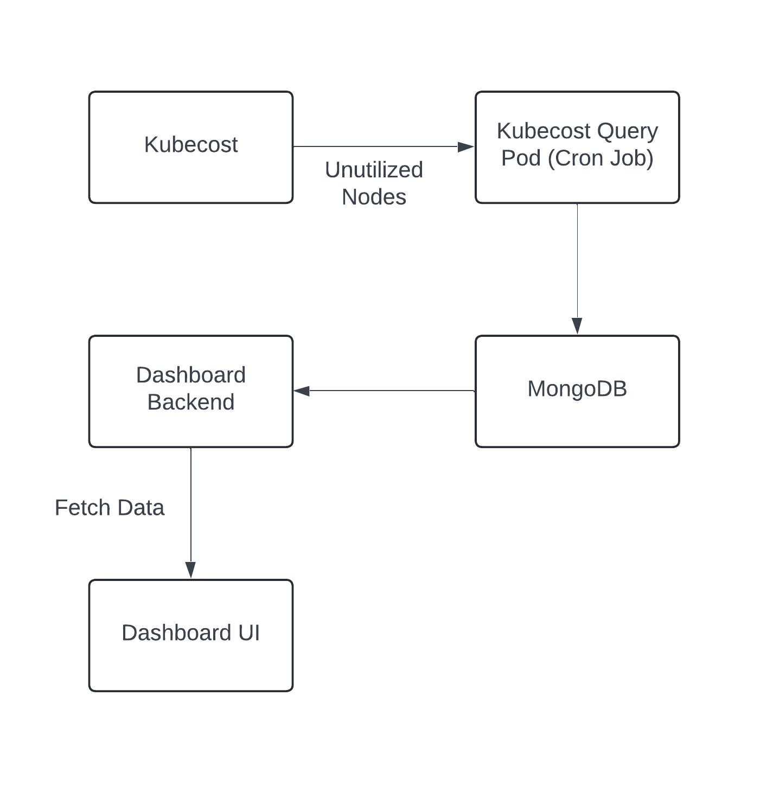

# X-Workflow 2: Detecting Unutilized Nodes in a Kubernetes Cluster

## Overview

X-Workflow 2 aims to identify unutilized nodes in a Kubernetes cluster, and display them on a dashboard using API for user information. The workflow involves querying Kubecost for cost-based node utilization data, storing this information in MongoDB, and providing a user interface for node monitoring.

## Data Flow/Architecture Diagram:
Data flow diagram is as follows:



Here is the documentation in Markdown format:

## How it Works:

1. **Kubecost Query Pod**:
   - The query pod continuously queries Kubecost to retrieve node data based on cost and utilization.
   - The query pod dumps this data into a MongoDB database deployed as a StatefulSet in the cluster.
2. **Flask Backend**:
   - The backend pod queries the MongoDB database to display results to users about underutilized pods.

## Steps for Installation and Testing

### 1. Setup Kind Cluster

Deploy a Kind cluster for local Kubernetes testing using `kind_cluster/kind_cluster.yaml`.

```bash
kubectl apply -f kind_cluster/kind_cluster.yaml
```

### 2. Install Kubecost

Follow the instructions to install Kubecost on your Kubernetes cluster:
- [Kubecost Installation Guide](https://docs.kubecost.com/install-and-configure/install)

### 3. Deploy MongoDB StatefulSet

Deploy MongoDB using the StatefulSet configuration (`k8s_yaml_files/mongodb-statefuleset.yaml`).

```bash
kubectl apply -f k8s_yaml_files/mongodb-statefuleset.yaml
```

### 4. Deploy Kubecost Query Pod

1. **Build Docker Image for Kubecost Query Pod**:

   Navigate to the `kubecost_query_pod_go` directory and build the Docker image.

   ```bash
   cd kubecost_query_pod_go
   docker build -t <image_registry_name>/kubecost_query_pod_go -f Dockerfile .
   docker push <image_registry_name>/kubecost_query_pod_go
   ```

2. **Update Image Tag**:

   Update the image tag in `k8s_yaml_files/kubecost_query_pod.yaml` to the one you just pushed.

3. **Deploy the Kubecost Query Pod**:

   ```bash
   kubectl apply -f k8s_yaml_files/kubecost_query_pod.yaml
   ```

### 5. Deploy Flask Backend

1. **Build Docker Image for Flask Backend**:

   Navigate to the `flask_backend` directory and build the Docker image.

   ```bash
   cd flask_backend
   docker build -t <image_registry_name>/flask_backend -f Dockerfile .
   docker push <image_registry_name>/flask_backend
   ```

2. **Update Image Tag**:

   Update the image tag in `k8s_yaml_files/flask-backend-deployment.yaml` to the one you just pushed.

3. **Deploy the Flask Backend**:

   ```bash
   kubectl apply -f k8s_yaml_files/flask-backend-deployment.yaml
   ```

### 6. Access the API

The Flask backend service is set up as a NodePort service. This means you can access it using `NODE_IP:NODEPORT`.

1. **Find the NodePort**:

   ```bash
   kubectl get svc
   ```

2. **Find the Node IP**:

   ```bash
   kubectl get nodes -o wide
   ```

   The `EXTERNAL-IP` column will show the IP address of your nodes.

3. **Access the API**:

   Open your browser and navigate to `http://NODE_IP:NODEPORT/nodes` to see the API results.

### Additional Notes

- The Docker image registry needs to be publicly accessible so that the pod can pull the container image. If the registry is private, you need to set up registry authentication accordingly.

By following these steps, you should be able to set up and test the Kubecost query pod, MongoDB StatefulSet, and Flask backend successfully.

    
## 🧾 License

XkOps is licensed under Apache License, Version 2.0. See [LICENSE.md](https://github.com/XgridInc/xkops/blob/master/LICENSE "LICENSE.md") for more information